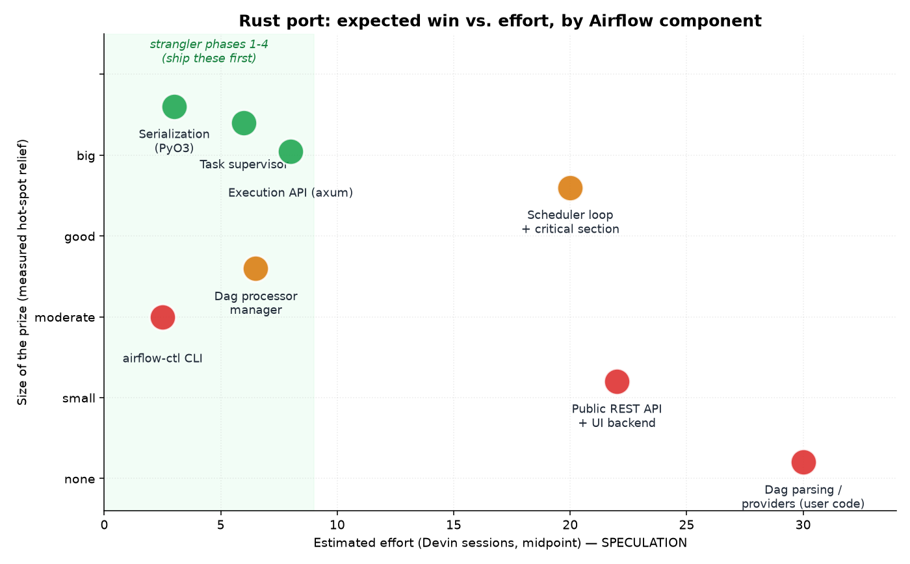
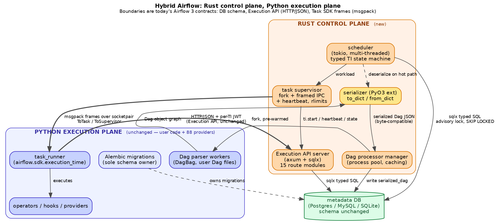

<!--
 Licensed to the Apache Software Foundation (ASF) under one
 or more contributor license agreements.  See the NOTICE file
 distributed with this work for additional information
 regarding copyright ownership.  The ASF licenses this file
 to you under the Apache License, Version 2.0 (the
 "License"); you may not use this file except in compliance
 with the License.  You may obtain a copy of the License at

   http://www.apache.org/licenses/LICENSE-2.0

 Unless required by applicable law or agreed to in writing,
 software distributed under the License is distributed on an
 "AS IS" BASIS, WITHOUT WARRANTIES OR CONDITIONS OF ANY
 KIND, either express or implied.  See the License for the
 specific language governing permissions and limitations
 under the License.
-->

# Porting Airflow's control plane to Rust — a speculative design analysis

**Status:** exploratory design document. Nothing here is a proposal to merge, and no Rust code exists.
**Subject version:** this tree, `airflow.__version__ == 3.4.0`.
**Convention used throughout:** every claim is tagged **[EVIDENCE]** (measured on this machine, or read
directly out of the source in this repo, with file and line) or **[SPECULATION]** (a forecast, an estimate,
or an architectural opinion). If a number is not tagged **[EVIDENCE]**, it is a guess and should be treated
as one.

---

## 0. Executive summary

Three findings dominate everything else in this document.

1. **The scheduler's cost is not Python arithmetic — it is SQL round trips and ORM hydration.**
   Measured on a local Postgres 16 with 20 Dags / 400 tasks, a *loaded* scheduler loop takes
   **456.5 ms and issues 172.3 SQL statements per loop**, while a single round trip to that same
   database costs **0.075 ms** and the critical-section `TaskInstance` query costs **~1.2 ms**
   (§1.3, **[EVIDENCE]**). The gap between "17 ms of SQL" and "456 ms of loop" is Python-side
   orchestration, ORM object hydration, and per-row decision logic — that is the part Rust addresses,
   and it is real, but it is bounded by the fact that a Rust scheduler still has to issue those same
   172 statements unless the *query plan* changes too.

2. **Cold start and per-process memory are the most defensible wins, and they are large.**
   `import airflow.sdk.execution_time.task_runner` alone costs **1.10–1.15 s and ~117 MB RSS**;
   after parsing one 20-task Dag file the process sits at **~129 MB** (§1.4, **[EVIDENCE]**).
   Every task instance pays that. `airflow version` — the cheapest possible CLI invocation — takes
   **1.33 s** (§1.6, **[EVIDENCE]**). A Rust supervisor/CLI/API binary would start in single-digit
   milliseconds with single-digit-MB RSS **[SPECULATION]**, and this is the one axis where the
   improvement is order-of-magnitude rather than incremental.

3. **Dag authoring is Python and always will be, and Airflow 3 already drew the line for us.**
   The Task SDK ↔ Execution API boundary (`task-sdk/src/airflow/sdk/execution_time/`,
   `airflow-core/src/airflow/api_fastapi/execution_api/routes/`, 15 route modules) is already a
   process-isolated, versioned, msgpack/HTTP protocol between the control plane and user code
   (§4, **[EVIDENCE]**). That de-risks a control-plane port more than any other single fact in this
   analysis: a Rust scheduler + supervisor + API server can speak the *existing* protocol to the
   *existing* Python task runner, with zero changes to user Dags.

The honest counterweight (§7): the workloads where Airflow users actually feel pain — a Kubernetes pod
taking 20 s to schedule and pull an image, a `BigQueryInsertJobOperator` waiting 4 minutes on a remote
API — are untouched by any of this. Rust wins where Airflow's *overhead* is, and Airflow's overhead is a
small fraction of most real pipelines' wall-clock time.

---

## 1. Where the current Python implementation actually costs you

### 1.1 Measurement setup (so the numbers can be judged)

**[EVIDENCE]** All measurements below were taken on this session's VM: Linux x86_64, Python 3.12.8,
Airflow 3.4.0 from this tree installed into a local `uv` venv, metadata DB = Postgres 16 in Docker on
`127.0.0.1` (so DB latency is *best case* — a real deployment's RDS is 1–3 ms away, not 0.075 ms).
The harness is committed alongside this document as `dev/rust_port_measure.py`; each subcommand prints
one JSON document. Where a measurement is a min-of-N, that is stated.

Caveats I want on the record, because they bound what these numbers prove:

- Single machine, no contention: no second scheduler, no concurrent UI traffic, no network DB latency.
- The "loaded scheduler" benchmark runs `SchedulerJobRunner._execute()` in-process with `num_runs`
  bounded, with `LocalExecutor`; it is a *shape* measurement (SQL count, loop latency), not a
  throughput benchmark you should quote as "Airflow does N tasks/sec".
- Dag-parse numbers use synthetic linear `BashOperator` Dags. Real Dags import pandas, boto3, or a
  provider SDK, and parse 10–100× slower. My numbers are therefore a *floor* on parse cost, and the
  Rust-vs-Python comparison in §2.2 is correspondingly *conservative in Python's favour*.

### 1.2 The scheduler loop: structure, then cost

**[EVIDENCE]** `airflow-core/src/airflow/jobs/scheduler_job_runner.py` is 4,248 lines.
`_run_scheduler_loop` (L1767) is a single-threaded `for loop_count in itertools.count(start=1)` that,
each iteration, serially performs: `_do_scheduling` (L1967) in one session; then `executor.heartbeat()`
for every executor; then `_process_executor_events` (L1322) in a *second* session; then deadline
handling, callback routing, task-event-log flushing, connection-test polling, its own job heartbeat,
periodic timers, and finally an idle sleep.

That serial structure is the architectural cost, and it is visible in the SQL trace. Measured
(20 Dags × 20 tasks, Postgres, `scheduler-loop`):

| Scenario | ms/loop | SQL statements/loop | RSS |
| --- | --- | --- | --- |
| Empty DB (nothing to schedule) | 41.2 | 19.1 | 145.9 MB |
| 20 Dags / 400 tasks serialized, runs being created | **456.5** | **172.3** | 154.6 MB |

**[EVIDENCE]** (`dev/rust_port_measure.py scheduler-loop 20` and `... 30`.) Note the shape: work grows
the statement count ~9× and the latency ~11×. The loop is doing per-Dag and per-DagRun round trips, not
one set-based pass.

**[EVIDENCE]** The critical section, `_executable_task_instances_to_queued` (L639–L1047), is where the
design constraint lives:

```python
lock_acquired = session.execute(
    text("SELECT pg_try_advisory_xact_lock(:id)").bindparams(id=DBLocks.SCHEDULER_CRITICAL_SECTION.value)
).scalar()  # L663-L667
pools = Pool.slots_stats(lock_rows=True, session=session)
concurrency_map = ConcurrencyMap()
concurrency_map.load(session=session)  # L697-L698
```

then, inside `for loop_count in itertools.count(start=1)` (L710), it builds a `select(TI)` joined to
`DagRun` and `DagModel` plus a per-DagRun concurrency subquery (L722ff), narrows it by four
progressively-grown Python sets — `starved_pools`, `starved_dags`, `starved_tasks`,
`starved_tasks_task_dagrun_concurrency` (L749–L760) — takes `FOR UPDATE SKIP LOCKED` row locks
(`with_row_locks(..., skip_locked=True)`, L820), hydrates the rows into ORM `TaskInstance` objects, and
then applies pool / max_active_tasks / per-task / per-DagRun / team / executor-slot limits **in Python**,
re-issuing the query when it starves something (L878–L971).

This is the single most important piece of code in the whole analysis, so let me be precise about what
is and is not a Python problem:

- **Python problem.** The rows come back as ORM entities and are filtered row-by-row in an interpreted
  loop, with eager loads attached; a starve on any dimension throws away the batch and re-queries.
- **Not a Python problem.** The advisory transaction lock serializes *all* schedulers through this
  section regardless of implementation language. A Rust scheduler holds the same lock. Making the
  section 5× faster does raise ceiling throughput (the lock is held for less time), which is a real
  and underrated win — but it is a constant-factor win on a serialized region, not concurrency.

**[EVIDENCE]** Component latencies under that lock, measured against local Postgres
(`dev/rust_port_measure.py db-latency`, min / median ms):

| Operation | min | median |
| --- | --- | --- |
| `SELECT 1` (pure round trip) | 0.075 | 0.078 |
| `SELECT pg_try_advisory_xact_lock(1)` | 0.078 | 0.081 |
| `select(TI).where(state=='scheduled').limit(512)` incl. ORM hydration | 0.663 | 1.196 |
| `Pool.slots_stats(lock_rows=False)` | 1.584 | 2.193 |

**[EVIDENCE]** SQLAlchemy statement *compilation* for that `TaskInstance` query is ~3.0 ms
(`dev/rust_port_measure.py orm`) — i.e. on a cache miss, compiling the SQL costs more than executing it.
SQLAlchemy caches compiled statements, so this is not paid every loop, but it is paid on every
cache-invalidating variation, and the `starved_*` filters above *are* variations: adding
`TI.pool.not_in(...)` / `tuple_(...).not_in(...)` changes the statement shape.

**[SPECULATION]** A Rust rewrite of this section with hand-written SQL and no ORM identity map would
plausibly land at 3–8× lower CPU time in the section, with the DB time unchanged. Since (from the table
above) the DB itself accounts for only single-digit milliseconds, the win is mostly in the 456 ms of
non-DB loop time.

### 1.3 What the 456 ms is actually made of

**[SPECULATION, informed by the SQL trace]** From the statement histogram of the loaded run, the loop
issues per-Dag/per-DagRun queries: `SELECT dag_run...` (twice per loop), asset-partition and
asset-dag-run-queue scans, a `serialized_dag` fetch, `dag` metadata fetch, per-Dag run counts, the
advisory lock, and `slot_pool`. At 172 statements/loop and ~1 ms each on *local* Postgres, SQL accounts
for roughly 20–40% of the loop; the rest is Python: ORM hydration, `SerializedDAG` deserialization to
get task dependencies, `TaskInstance` state-machine evaluation, and executor bookkeeping. On a
deployment where the DB is 2 ms away rather than 0.08 ms, the same 172 statements become ~350 ms of
pure network wait and the Python fraction *shrinks*. That asymmetry is the core of §7.

### 1.4 The Dag file processor and serialization

**[EVIDENCE]** `airflow-core/src/airflow/dag_processing/manager.py` (1,797 lines) runs
`_run_parsing_loop` (L554) which manages a pool of parser subprocesses, polls their sockets via
`selectors`, collects `DagFileParsingResult` objects, and separately scans for stale Dags and purges
warnings. `processor.py` (743 lines) does the actual work: `_parse_file` (L235) checks file stability,
builds a `BundleDagBag`, and calls `_serialize_dags` (L271), which is simply:

```python
for dag in bag.dags.values():
    data = DagSerialization.to_dict(dag)
    serialized_dags.append(LazyDeserializedDAG(data=data, last_loaded=dag.last_loaded))
```

**[EVIDENCE]** Parse + serialize + deserialize, 20 synthetic files × 20 tasks
(`dev/rust_port_measure.py parse-dir`):

| Phase | Total | Per Dag |
| --- | --- | --- |
| `DagBag` parse (20 files, 400 tasks) | 66.5–72.3 ms | 3.3–3.6 ms |
| `DagSerialization.to_dict` × 20 | 88.7–91.3 ms | ~4.5 ms |
| `DagSerialization.from_dict` × 20 | 19.4 ms | ~1.0 ms |
| Serialized JSON size | 217,990 bytes | ~10.9 KB |
| Import errors | 0 | |

Note the inversion: **serializing the Dags costs more than parsing the Python that defined them**
(91 ms vs 67 ms). That is a pure-CPU, pure-Python cost in Airflow's own code, not in user code.

**[EVIDENCE]** Scaling, on synthetic single-Dag chains (`dev/rust_port_measure.py serialize`), min-of-5:

| Tasks | `to_dict` | JSON bytes | `json.loads` alone | `from_dict` |
| --- | --- | --- | --- | --- |
| 10 | 2.0 ms | 5,559 | — | 0.6 ms |
| 100 | 12.6 ms | 49,120 | — | 3.8 ms |
| 500 | 60.4 ms | 244,720 | — | 18.0 ms |
| 1000 | 121.0 ms | 489,221 | **3.03 ms** | 35.9 ms |

**[EVIDENCE]** The last row is the punchline for §2.5: at 1,000 tasks, parsing the JSON bytes costs
3.03 ms while Airflow's serializer costs 121 ms to produce them and 35.9 ms to rebuild objects from
them. **~97% of `to_dict` is Airflow's own Python type-dispatch logic, not JSON encoding.**
`serialized_objects.py` is 2,367 lines of exactly that dispatch.

**[EVIDENCE]** Pure Dag *construction* (no file IO, no serialization) is 9.6 ms for 100 tasks and
105.1 ms for 1,000 (`dev/rust_port_measure.py build-dag`) — that cost is in the Task SDK's operator
`__init__` chain and is **unavoidable for any port**, because it is user-facing Python semantics.

**[EVIDENCE]** Real-world floor: parsing the 46 bundled example Dag files (91 Dags, 236 tasks) takes
**1,952 ms total, 42.4 ms/file**, leaving the process at 214.5 MB RSS. Example Dags import provider
operators; that 13× per-file gap versus my synthetic Dags (3.3 ms) is the cost of *imports*, which no
control-plane rewrite removes.

### 1.5 Task process fork overhead and worker memory

**[EVIDENCE]** `task-sdk/src/airflow/sdk/execution_time/supervisor.py` is 2,652 lines.
`ActivitySubprocess.start` (L1402) delegates to `WatchedSubprocess.start` (class at L628), which forks,
creates socketpairs, puts the child in a new process group, and drives it with `selectors`. The parent
then calls, in `_on_child_started`:

```python
ti_context = self.client.task_instances.start(ti.id, self.pid, datetime.now(tz=timezone.utc))
```

before sending `StartupDetails` down the socket. Heartbeating is governed by
`HEARTBEAT_TIMEOUT` (L182), `MIN_HEARTBEAT_INTERVAL` (L184), `MAX_FAILED_HEARTBEATS` (L185), with the
supervisor failing the TI after `MAX_FAILED_HEARTBEATS` (L1720).

**[EVIDENCE]** The IPC framing is already efficient: `msgspec.msgpack.Decoder[_RequestFrame]`
(supervisor L2344) and `TypeAdapter(ToTask)` / `TypeAdapter(ToSupervisor)` discriminated unions
(`comms.py` L230, supervisor L1397). The Execution API client is `httpx` with `tenacity` retries
(`task-sdk/src/airflow/sdk/api/client.py`).

**[EVIDENCE]** Costs measured:

| Quantity | Value |
| --- | --- |
| `fork()` + socketpair round trip, warm interpreter w/ DagBag loaded | min 2.63 ms, median 2.91 ms |
| Same, minimal interpreter | min 0.36 ms, median 0.54 ms |
| Parent RSS at fork time (warm) | ~174.5 MB |
| `import airflow.sdk.execution_time.task_runner` in a fresh process | **1,104.9–1,154.6 ms**, RSS 116.4–116.9 MB |
| + parse one 20-task Dag file | +5.6 ms, **RSS 129.1–129.6 MB** |

**[EVIDENCE]** So the fork itself is cheap (0.4–2.9 ms) — but note it is **5–8× more expensive from a
fat parent than a thin one**, which is a direct memory-footprint tax on page-table copying. The
expensive part is what the child must *hold*: ~129 MB of interpreter + SDK + user Dag per concurrent
task. At 64 concurrent tasks that is ~8 GB of RSS that is ~90% duplicated interpreter state.

**[EVIDENCE]** `LocalExecutor` (`airflow-core/src/airflow/executors/local_executor.py`, 325 lines)
pre-spawns `parallelism` worker processes via `multiprocessing` (`_run_worker`, L64) each blocking on a
`SimpleQueue`. With `parallelism=32` that is 32 idle Python interpreters before any task runs — observed
directly in the benchmark logs ("Worker starting up pid=…" × 32).

### 1.6 GIL, cold start, dependency bloat

**[EVIDENCE]** Import cost and footprint, fresh interpreter each time
(`dev/rust_port_measure.py imports <module>`):

| Module | Import time | RSS |
| --- | --- | --- |
| `airflow` | 1,082.1 ms | 109.9 MB |
| `airflow.sdk` | 1,017.8 ms | 109.8 MB |
| `airflow.jobs.scheduler_job_runner` | 1,475.8 ms | 126.3 MB |
| `airflow.serialization.serialized_objects` | 1,214.8 ms | 120.5 MB |
| `airflow.sdk.execution_time.task_runner` | 1,084.8 ms | 109.9 MB |
| `airflow.sdk.execution_time.supervisor` | 1,044.8 ms | 114.1 MB |
| `airflow.api_fastapi.app` | **1,984.7 ms** | **146.4 MB** |

**[EVIDENCE]** CLI wall clock, this venv: `airflow version` = **1,363 / 1,331 ms**;
`airflow dags list-import-errors` = **2,026 / 2,061 ms**. The dev venv is **917 MB** across
**638 site-packages entries**; the repo carries **88 provider directories**.

**[EVIDENCE]** GIL: the scheduler loop is structurally single-threaded (§1.2), and the Dag processor and
executors work around the GIL with *processes* — `multiprocessing` workers in `LocalExecutor`, forked
parsers in `manager.py`, forked task children in the supervisor. Each process is a fresh ~110 MB
interpreter. The GIL's true cost in Airflow is therefore **not slow threads; it is that Airflow's
concurrency unit is a 110 MB process instead of a 100 KB task.**

---

## 2. What Rust concretely buys, component by component

All numbers in this section are **[SPECULATION]** unless they restate a measurement from §1. I have
tried to keep the forecasts anchored: where the Python cost is provably CPU-in-Airflow's-own-code
(serialization, state-machine evaluation, process startup) I forecast large wins; where the cost is DB
or user code I forecast none.

### 2.1 Scheduler loop — **big win on latency, marginal on end-to-end throughput**

- Replace ORM hydration with `sqlx`-style typed row structs; replace the `starved_*` Python re-query
  loop with a single set-based SQL pass (window functions per pool/dag/task already exist in the query).
- Run the loop's independent phases concurrently on `tokio` — executor heartbeats, event processing,
  callback routing, timer work — instead of the serial chain at L1767–L1965.
- Forecast: **3–8× lower CPU per loop**; loop latency from 456 ms → 60–150 ms at the same workload
  **[SPECULATION]**. Task-queueing throughput ceiling rises roughly proportionally to the reduction in
  critical-section hold time.
- Ceiling, stated honestly: the advisory lock (L663) and the DB round trips remain. On a 2 ms-RTT
  managed DB the win shrinks to maybe 1.5–2× end-to-end.

### 2.2 Dag file processor — **cannot be ported; only the supervisor around it can**

Parsing a Dag file *is executing user Python*. Rust cannot parse Dags. What Rust replaces is
`manager.py`'s 1,797 lines of process-pool + selector + bundle-refresh + staleness-scan orchestration.

- Forecast: manager overhead → near zero; parser processes remain Python and keep their ~42 ms/file
  (measured) real-world cost.
- Real win available here: a Rust manager can afford **content-hash-based parse skipping and a
  persistent parse cache** cheaply, and can keep a pool of *pre-warmed* Python interpreters (paying the
  1.0 s import once per worker rather than per parse cycle) **[SPECULATION]**.
- Verdict: **marginal on parse CPU, moderate on scheduling latency and memory.**

### 2.3 Executor / worker supervisor — **big win, and the most tractable**

The supervisor (§1.5) is pure control logic: fork, framed msgpack IPC, heartbeat timers, state
transitions, log relaying. There is no user Python in it — the user Python is in the *child*.

- A Rust supervisor spawns the Python task child, speaks the existing `ToTask`/`ToSupervisor` msgpack
  protocol, and holds ~2–5 MB RSS instead of ~117 MB **[SPECULATION]**, i.e. it removes the
  supervisor-side half of the per-task memory tax **[EVIDENCE for the 117 MB baseline]**.
- Thousands of supervised tasks per node become a `tokio` task each rather than a process each.
- Structured concurrency plus `cgroups`/`rlimit` enforcement per child gives per-task CPU/memory caps
  that Airflow currently cannot enforce natively.
- Verdict: **big win on memory and supervision density; no change to the task's own runtime.**

### 2.4 API server — **big win on cold start and tail latency, moderate on throughput**

- Measured baseline: `import airflow.api_fastapi.app` = 1,984.7 ms / 146.4 MB **[EVIDENCE]**.
- `axum` + `sqlx`: startup in low milliseconds, ~10–20 MB RSS, and — the part that matters more —
  no per-worker interpreter, so the Execution API's high-frequency small calls
  (`task_instances.start`, heartbeats, XCom get/put) stop competing for GIL time inside a gunicorn
  worker. Forecast **5–20× on requests/sec/core for these small JSON endpoints** and much tighter p99
  **[SPECULATION]**.
- Caveat: the *public* REST API's value is its OpenAPI surface and its UI coupling; porting it is a
  large, low-reward slog. Port the **Execution API** (15 route modules, machine-to-machine, versioned)
  and leave the public API in FastAPI.

### 2.5 Serialization layer — **big win, best effort-to-reward ratio in the whole document**

The measurement in §1.4 is unusually clean: 121 ms to serialize a 1,000-task Dag of which 3.03 ms is
JSON encoding. The remaining ~118 ms is `serialized_objects.py` type dispatch.

- A Rust encoder/decoder over the same JSON schema, driven from PyO3 (walk the Python Dag object graph
  once in Rust, emit the existing wire format) plausibly reaches **10–30× on `to_dict`** and
  **10–20× on `from_dict`** **[SPECULATION]**.
- Why it is the best target: the wire format is already a documented JSON contract stored in
  `serialized_dag.data`, so a Rust implementation is **drop-in and independently testable against the
  Python one** (differential-test the two encoders over the whole example-Dag corpus). No architecture
  change, no protocol change, no migration.
- And the scheduler benefits twice: it deserializes Dags on the hot path (`serialized_dag` fetch is in
  the per-loop statement histogram, **[EVIDENCE]**).

### 2.6 CLI — **big win, low value**

`airflow version` = 1,363 ms **[EVIDENCE]**; a Rust CLI would be ~5 ms **[SPECULATION]**. This is
delightful and mostly cosmetic — except for two real cases: (a) CI/scripted invocations in tight loops,
and (b) `airflow-ctl`, which is a pure API client and therefore a *genuinely easy* full port with no
Python dependency at all.

### 2.7 Component summary



The conceptual difference the port makes to the scheduler is a topology change, not just a speed-up:

```text
TODAY (Python, one loop, one process)          PROPOSED (Rust control plane)

  loop {                                       tokio runtime {
    _do_scheduling           ─┐                  ┌─ shard A: dags 0..n ─┐
    executor.heartbeat()      │ strictly         ├─ shard B: dags n..m ─┤ concurrent,
    _process_executor_events  │ serial,          ├─ executor events ────┤ shared
    deadlines / callbacks     │ one thread       ├─ heartbeats / timers ─┤ caches
    heartbeat / timers        │                  └─ callbacks ──────────┘
    sleep                    ─┘                }
  }                                            still serialized: pg advisory lock
  concurrency unit = a 110 MB process           concurrency unit = a ~KB task
```

**[EVIDENCE]** for the left column (`scheduler_job_runner.py` L1767–L1965; ~110 MB per interpreter,
§1.6); **[SPECULATION]** for the right.


Effort is in **Devin sessions** (one session ≈ a focused multi-hour engineering push with tests), and is
the estimate I would defend for the *first working, wire-compatible, tested* version of each component —
not for production hardening across all backends.

| Component | Expected win | Latency | Throughput | Memory | Cold start | Effort (Devin sessions) | Size of prize |
| --- | --- | --- | --- | --- | --- | --- | --- |
| Serialization (`to_dict`/`from_dict` via PyO3) | 10–30× CPU on serialize | high | high | mild | n/a | **2–4** | **Big / cheap — do first** |
| Task supervisor (fork + IPC + heartbeat) | 117 MB → ~3 MB per supervised task | mild | high (density) | **very high** | high | **4–8** | **Big** |
| Execution API server (`axum` + `sqlx`) | 5–20× rps on small endpoints; ~2 s → ~5 ms start | high | high | high | **very high** | **6–10** | **Big** |
| Scheduler critical section + loop | 456 ms → 60–150 ms/loop; shorter lock hold | **high** | moderate | moderate | high | **10–18** | Big, with a DB-bound ceiling |
| Dag processor *manager* (not the parser) | manager overhead → ~0; caching becomes cheap | moderate | mild | moderate | mild | **5–8** | Moderate |
| `airflow-ctl` CLI | 1.3 s → ~5 ms | high | n/a | high | **very high** | **2–3** | Small but easy |
| Public REST API + UI backend | mostly cold start | mild | moderate | high | high | **15–30** | **Small / expensive — don't** |
| Dag parsing (user code) | **none — cannot be ported** | — | — | — | — | ∞ | None |
| Operators / providers (88 dirs) | **none — cannot be ported** | — | — | — | — | ∞ | None |

**[SPECULATION]** for every cell. Sessions are additive but heavily serialized by review and
compatibility testing; see §6.

---

## 3. New capabilities, not just speed

These matter more than the benchmarks, because several are things Airflow *cannot currently do at all*.

1. **Single static binary.** Today a scheduler needs a 917 MB venv with 638 packages **[EVIDENCE]**.
   A `scheduler`/`supervisor`/`api` binary of 20–40 MB with no Python at all for the control plane
   **[SPECULATION]** changes the deployment story qualitatively: no dependency resolution, no
   `constraints.txt`, no "provider X pins protobuf". Note the asymmetry — *workers* still need the
   Python environment, so this simplifies the control plane, not the whole cluster.
2. **Embeddable / portable Airflow.** A `libairflow_core` that a test harness, a laptop, or another
   product embeds in-process — plausibly with an embedded Postgres-compatible store (this is exactly
   where a `pglite`-style embedded backend becomes interesting) — makes "run a real scheduler in a unit
   test in 50 ms" feasible **[SPECULATION]**.
3. **WASM target.** The control plane compiled to `wasm32-wasip1` gives a browser- or edge-hostable
   scheduler for demos, teaching, and dry-run planning. What does **not** work: executing Python tasks
   (Pyodide can run *some* Dag code, but not `boto3`-shaped provider stacks). So WASM Airflow is
   realistically **"the planner and the UI, with a mocked or restricted execution plane"** — genuinely
   useful, and much easier to reach from Rust than from CPython **[SPECULATION]**.
4. **True multithreaded scheduling.** Not "faster loops" — *different topology*: shard Dags across
   worker threads inside one process with shared caches (serialized-Dag cache, pool stats), instead of
   today's choice between one process or N processes fighting over one advisory lock **[SPECULATION]**.
   This is the change that could actually lift the scheduling ceiling rather than the constant factor.
5. **Illegal states unrepresentable.** `TaskInstanceState` is a string enum on a mutable ORM row and
   transitions are enforced by convention across thousands of lines. In Rust, encode the TI lifecycle as
   a typed state machine (`Scheduled -> Queued -> Running -> Terminal`) where a transition function is
   the only way to move, so "running task with no start_date" or "success with a running heartbeat"
   cannot be constructed **[SPECULATION]**. Airflow has had a long tail of stuck-state bugs
   (queued-but-not-running, zombie reconciliation — cf. `MAX_FAILED_HEARTBEATS` handling at
   supervisor L1720 **[EVIDENCE]**); this class of bug is what typestate eliminates.
6. **Deterministic per-task resource limits.** A Rust supervisor sets `rlimit`/cgroup v2 limits on the
   child before `exec`, giving hard memory/CPU caps with clean OOM attribution — currently a
   deployment-level concern, not an Airflow feature **[SPECULATION]**.
7. **Structured concurrency.** Cancellation today is signals plus timeouts plus a heartbeat protocol.
   With `tokio` task trees, cancelling a DagRun cancels its whole subtree deterministically
   **[SPECULATION]**.
8. **WASM plugin sandboxing.** Plugins/listeners/timetables currently run as arbitrary in-process
   Python with full DB and filesystem access. A `wasmtime` host could run untrusted
   timetables/policies/listeners with capability-based limits — a real multi-tenant feature, not a
   performance one **[SPECULATION]**. Timetables are the ideal first candidate: pure functions from
   dates to intervals.

---

## 4. The hard part: hybrid architecture (and how much Airflow 3 already did)

### 4.1 The boundary already exists

**[EVIDENCE]** This repo's `AGENTS.md` states the architecture as policy: the scheduler "**never runs
user code**", workers "**never access the metadata DB directly**" and talk to the API server through the
Execution API with a short-lived per-TI JWT, and the Dag processor is steered through the Execution API
too. Concretely:

- `airflow-core/src/airflow/api_fastapi/execution_api/routes/` — 15 modules: `task_instances`,
  `xcoms`, `variables`, `connections`, `assets`, `asset_events`, `dag_runs`, `task_reschedules`,
  `hitl`, `health`, `connection_tests`, `task_state_store`, `asset_state_store`, `dags`, `__init__`.
- `task-sdk/src/airflow/sdk/execution_time/comms.py` (1,301 lines) — the message union: `ToTask` /
  `ToSupervisor` Pydantic models behind `TypeAdapter`, framed with `msgspec.msgpack`.
- `task-sdk/src/airflow/sdk/api/client.py` — `httpx` client with retry policy, correlation-id and
  trace-context injection.
- `supervisor.py` — the process boundary itself (fork, socketpair, selector loop, heartbeats).

**This is the single most important de-risking fact in this document.** A Rust control plane does not
need to invent a protocol, negotiate a new contract with users, or reimplement operator semantics. It
needs to (a) speak the Execution API's HTTP surface as a *server*, and (b) speak the supervisor's
msgpack frame protocol as a *parent process*. Both are already versioned, already exercised by tests,
and already assume the other side is a separate process.

**[SPECULATION]** My estimate: the Task SDK boundary removes roughly **60–70% of the risk** of a
control-plane port, and it converts the project from "rewrite Airflow" into "reimplement three
well-specified network/IPC peers". Without Airflow 3, I would not consider this project viable at all.

### 4.2 Target topology



(Source: `docs/images/rust-port-hybrid-architecture.svg`, generated with Graphviz.)

**[SPECULATION]** Design rules I would hold to:

- **The DB schema is the compatibility contract, not the code.** Rust components read/write the exact
  same tables via `sqlx` with compile-time-checked queries against a live schema, and Alembic in Python
  remains the sole owner of migrations. This lets a Rust scheduler and a Python scheduler run against
  the same DB during migration.
- **Never re-encode the wire formats.** Serialized-Dag JSON and Execution API payloads stay
  byte-compatible; differential tests, not shared code, enforce that.
- **PyO3 only where you need the Python object graph** (i.e. the serializer in §2.5). Do *not* embed
  CPython in the scheduler — that reimports the GIL you were trying to escape. Task execution stays in
  child processes.
- **The protocol is the seam, so both sides stay replaceable**: a Rust supervisor must work with the
  current Python `task_runner`, and the current Python supervisor must work with a Rust Execution API.
  Every phase in §6 is independently revertible because of this.

---

## 5. Ecosystem realism

**[SPECULATION]** with concrete reasoning; no benchmarks of my own on these crates.

**DB layer.** `sqlx` is the right choice: compile-time-verified SQL against the real schema is precisely
what you want when the schema is owned by someone else (Alembic) and the queries are the performance
story (§1.2). `diesel` wants to own the schema (its `schema.rs`/migrations model) — wrong fit here.
`SeaORM` reintroduces exactly the ORM-hydration overhead the port exists to remove. Note the real gap:
Airflow supports Postgres, MySQL and SQLite; `sqlx` covers all three, but the scheduler uses
dialect-specific behaviour (`pg_try_advisory_xact_lock`, the MySQL `USE INDEX (ti_state)` hint at
`scheduler_job_runner.py` L724, `SKIP LOCKED` semantics) **[EVIDENCE for the code]** — so per-dialect
implementations, not one abstraction, and MySQL will be the tail that drags.

**HTTP.** `axum` (tower ecosystem, tokio-native, minimal ceremony) over `actix-web`. The Execution API's
needs are modest: JWT verification, JSON bodies, structured logging, OpenTelemetry.

**Async runtime.** `tokio`, uncontroversially. The relevant caution: the scheduler's DB work is
`sqlx`-async but its *decision* work is CPU-bound; long synchronous decision passes must go to
`spawn_blocking` or a dedicated thread pool, or they stall the reactor and reproduce Python's serial
loop with extra steps.

**PyO3.** Two legitimate uses: (1) the serializer walking a live Dag object graph; (2) a Rust extension
imported *by* Python (a `airflow._core` native module) — which is also the lowest-friction distribution
channel, since it ships in the existing wheel and needs no deployment change. Costs to respect: GIL
acquisition per boundary crossing, ABI/version matrix across supported Pythons, and a `maturin`-based
build added to a release process that currently ships pure-Python wheels.

**The provider ecosystem is the wall.** 88 provider directories in this tree **[EVIDENCE]**; each is
Python wrapping a vendor SDK (`boto3`, `google-cloud-*`, `kubernetes`). Rewriting them is neither
possible nor desirable, and any design that requires it is dead. Corollary: **the Python execution plane
is permanent**, so per-task memory (~129 MB **[EVIDENCE]**) and per-task cold start (~1.1 s
**[EVIDENCE]**) are only *partly* reducible — the supervisor's share goes away, the child's does not.

**Prior art, honestly.** The Rust-rewrite successes in Python infrastructure are all
**single-purpose, no-plugin-API, batch tools**: `ruff` (linter), `uv` (resolver/installer),
`polars`/`arrow` (dataframes). They win because the entire hot path is theirs, they have no need to run
arbitrary user Python inside the hot loop, and they can be adopted one command at a time.
Where Rust rewrites of *stateful, plugin-heavy, long-running* systems stall is exactly where Airflow
lives: the plugin surface is the product. The instructive comparison is that nobody has successfully
replaced Django or Celery with a Rust equivalent while keeping their ecosystems — while `mypy`'s
`mypyc`-compiled core (a compile-the-hot-path strategy, not a rewrite) *did* ship. That pattern —
**compile or replace the hot components, keep the ecosystem** — is what §2.5/§2.3 propose, and it is the
only pattern with a track record here. Also note the *social* prerequisite: Airflow is an ASF project
with hundreds of Python contributors; a Rust control plane changes who can contribute to it, which is a
governance question at least as hard as the technical one.

---

## 6. Migration strategy (strangler fig)

**[SPECULATION]** throughout. Ordering principle: each phase must be independently shippable,
independently revertible, wire-compatible with the existing DB schema and Task SDK, and validated by
differential testing against the Python implementation. Effort in Devin sessions.

| Phase | Scope | Compatibility anchor | Exit criterion | Sessions |
| --- | --- | --- | --- | --- |
| **0. Harness** | Reproducible benchmarks (extend `dev/rust_port_measure.py`), Postgres + MySQL, 1k-Dag corpus, CI-tracked | none | Numbers in §1 reproducible on CI hardware, with variance | 2–3 |
| **1. Serializer** | Rust `to_dict`/`from_dict` as a PyO3 extension behind a feature flag | byte-identical `serialized_dag.data` | Differential test over all example Dags + provider test Dags passes; ≥10× on the §1.4 benchmark | 3–5 |
| **2. `airflow-ctl` in Rust** | Pure Execution/REST API client binary | OpenAPI spec | Feature parity on the top-20 commands; ~5 ms start | 2–3 |
| **3. Rust supervisor** | Replace `WatchedSubprocess` for a task, keeping the Python `task_runner` child | `ToTask`/`ToSupervisor` msgpack frames | Existing task-SDK test suite passes with the Rust parent; RSS/task drops by the supervisor's share | 5–8 |
| **4. Execution API server** | `axum` + `sqlx` reimplementation of the 15 execution-api routes, deployable side-by-side behind a router | route contracts + JWT scheme | Shadow traffic parity (response-diffing) for 100% of routes; p99 improvement demonstrated | 6–10 |
| **5. Scheduler critical section** | Rust binary owning only `_executable_task_instances_to_queued`, sharing the advisory lock with Python schedulers | `pg_try_advisory_xact_lock` + TI/pool tables | Runs alongside a Python scheduler on one DB for a soak period with no double-queueing; loop latency target met | 8–14 |
| **6. Full scheduler loop** | DagRun creation, dependency evaluation, timers, callbacks | DB schema | Rust scheduler passes `airflow-core` scheduler test suite semantics; can be swapped back at any time | 10–18 |
| **7. Dag processor manager** | Rust manager supervising pre-warmed Python parser workers | `DagFileParsingResult` payload | Parse throughput ≥ Python's with lower memory; import-error reporting identical | 5–8 |
| **8. Optional: WASM control plane** | `wasm32-wasip1` build of scheduler + planner with mocked execution plane | none (new product surface) | Browser demo plans a real Dag corpus | 6–12 |

**Total for phases 0–7: ~40–70 Devin sessions** **[SPECULATION]**, and I would treat that as a lower
bound: the estimates cover "works and is tested", not "supports MySQL, MSSQL-era edge cases, multi-team,
and every executor". Note the deliberate ordering — phases 1–3 deliver measurable user-visible wins
*before* anyone touches the scheduler, which is both the riskiest component and the one whose wins are
most DB-bound.

**Kill criteria** (state them up front, honestly): abandon after phase 1 if the Rust serializer does not
beat Python by ≥5× on real Dags; abandon after phase 3 if maintaining protocol compatibility across two
supervisor implementations costs more review time than it saves runtime; abandon after phase 5 if the
Rust critical section's win is <2× on a realistic (2 ms-RTT) database.

---

## 7. Honest counterarguments — reasons not to do this

1. **Most real Airflow latency is not Python CPU.** My own measurement says the scheduler issues 172
   statements per loaded loop **[EVIDENCE]** against a database 0.075 ms away **[EVIDENCE]**. Move that
   DB to a realistic 2 ms RTT and SQL waiting alone becomes ~350 ms/loop, dwarfing anything a language
   change fixes. And that is *before* the two costs users actually experience: Kubernetes pod
   scheduling + image pull (seconds to tens of seconds) and the operator's own remote work (minutes).
   **A 10× faster scheduler on a pipeline whose tasks take 5 minutes each is unobservable.**
2. **The task process cost — the biggest measured number — is mostly unfixable.** 1.1 s and ~129 MB per
   task child **[EVIDENCE]** is CPython importing the SDK and the user's Dag. A Rust supervisor removes
   its own footprint, not the child's. Claiming the 129 MB as a Rust win would be dishonest.
3. **Cheaper optimizations capture much of the value.** In rough order of value-per-effort:
   (a) `functools`-style caching / content-hash skipping in the Dag processor, and pre-warmed parser
   interpreters — attacks the measured 42.4 ms/file and the 1.0 s import directly;
   (b) reduce the 172 statements/loop by batching per-Dag queries into set-based ones — a pure-SQL
   change, no language change, and it attacks the dominant term;
   (c) replace the Python-side `starved_*` re-query loop with SQL window functions;
   (d) lazy-import the provider/API surface to cut the 1.0–2.0 s import cost **[EVIDENCE]** — Airflow
   has repeatedly harvested wins here already;
   (e) `mypyc`/Cython-compile `serialized_objects.py`, capturing part of §2.5's win inside the existing
   build. Each of these is 1–3 Devin sessions against 40–70 for the port **[SPECULATION]**.
4. **Two implementations is a permanent tax.** During (and after) migration, every protocol change,
   every new TI state, every provider requirement must land twice, reviewed by two skill sets. This is
   the cost that historically kills such projects — not the initial rewrite.
5. **Contributor-base risk.** Airflow's contributors are Python engineers. A Rust control plane narrows
   the pool that can fix a scheduler bug at 3 a.m., in an ASF project whose governance assumes broad
   participation.
6. **The typed-state-machine and sandboxing wins do not require Rust.** Stricter state transitions,
   an explicit TI state machine, and subprocess-based plugin isolation are all achievable in Python.
   If those are the goals, they are much cheaper without a port.
7. **`sqlx` will not paper over three dialects.** The dialect-specific code in the critical section
   (§5) means the Rust scheduler must reimplement Postgres *and* MySQL *and* SQLite behaviours, and
   subtle lock-semantics differences are exactly where correctness bugs hide.

**My overall read, stated plainly [SPECULATION].** A full port is not justified by the evidence I
gathered. Three carve-outs *are*: the **serializer** (§2.5 — a measured 97%-non-JSON overhead, drop-in,
2–4 sessions), the **supervisor** (§2.3 — removes ~117 MB per supervised task, protocol already exists),
and the **Execution API server** (§2.4 — high-frequency small endpoints, 2 s cold start today). Those
three are worth doing on their merits *whether or not* anyone ever ports the scheduler, and the
strangler ordering in §6 is built so that stopping after them is a success, not a failure.

---

## Appendix A — reproducing the measurements

```shell
# Harness lives at dev/rust_port_measure.py; run it in an env where Airflow is importable.
uv run --project airflow-core python dev/rust_port_measure.py imports airflow.sdk
uv run --project airflow-core python dev/rust_port_measure.py gen-dags /tmp/perf_dags 20 20
uv run --project airflow-core python dev/rust_port_measure.py parse-dir /tmp/perf_dags
uv run --project airflow-core python dev/rust_port_measure.py parse-examples
uv run --project airflow-core python dev/rust_port_measure.py serialize
uv run --project airflow-core python dev/rust_port_measure.py build-dag
uv run --project airflow-core python dev/rust_port_measure.py fork warm
uv run --project airflow-core python dev/rust_port_measure.py task-child-rss /tmp/perf_dags/perf_dag_0.py
uv run --project airflow-core python dev/rust_port_measure.py db-latency
uv run --project airflow-core python dev/rust_port_measure.py scheduler-loop 20
```

`scheduler-loop` and `db-latency` require a configured metadata DB; the numbers in this document used
Postgres 16 on localhost. `scheduler-loop` runs the real `SchedulerJobRunner` with a bounded `num_runs`
and instruments SQLAlchemy's `before_cursor_execute` to count statements.

## Appendix B — source map for the claims above

| Claim | Location |
| --- | --- |
| Serial scheduler loop | `airflow-core/src/airflow/jobs/scheduler_job_runner.py` L1767 (`_run_scheduler_loop`), L1967 (`_do_scheduling`), L1322 (`_process_executor_events`) |
| Critical section, advisory lock, starvation re-query | same file, L639–L1047 (lock L663, pools L697, query L722, `starved_*` L749–L760, row locks L820, Python filters L878–L971) |
| MySQL index hint / dialect coupling | same file, L724 |
| Dag processor manager loop | `airflow-core/src/airflow/dag_processing/manager.py` L554 |
| Parse + serialize per file | `airflow-core/src/airflow/dag_processing/processor.py` L235, L271 |
| Serialization dispatch | `airflow-core/src/airflow/serialization/serialized_objects.py` (2,367 lines) |
| Supervisor fork / IPC / heartbeat | `task-sdk/src/airflow/sdk/execution_time/supervisor.py` L628, L1402, L182–L185, L1720, L2344 |
| Message union + msgpack framing | `task-sdk/src/airflow/sdk/execution_time/comms.py` L230 |
| Execution API client transport | `task-sdk/src/airflow/sdk/api/client.py` |
| Execution API routes (15 modules) | `airflow-core/src/airflow/api_fastapi/execution_api/routes/` |
| LocalExecutor pre-spawned workers | `airflow-core/src/airflow/executors/local_executor.py` L64 |
| Architecture boundaries as policy | `AGENTS.md`, "Architecture Boundaries" |
